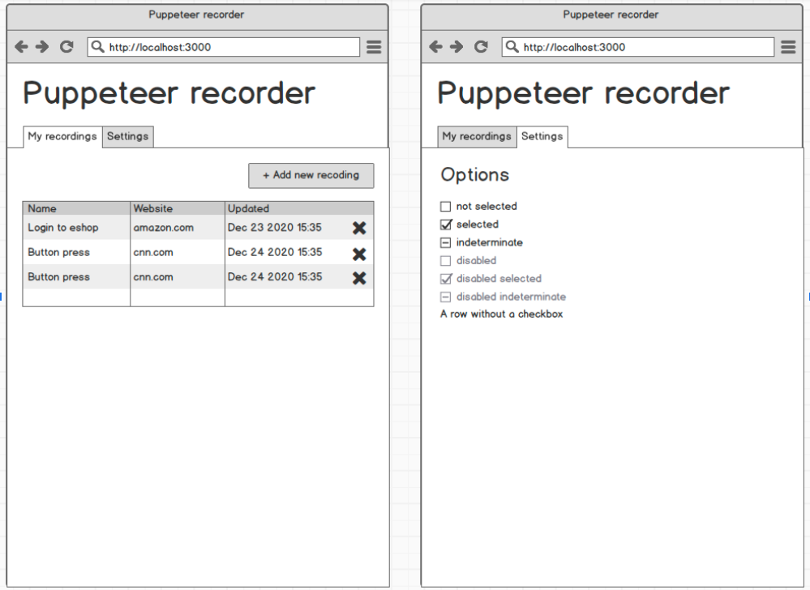
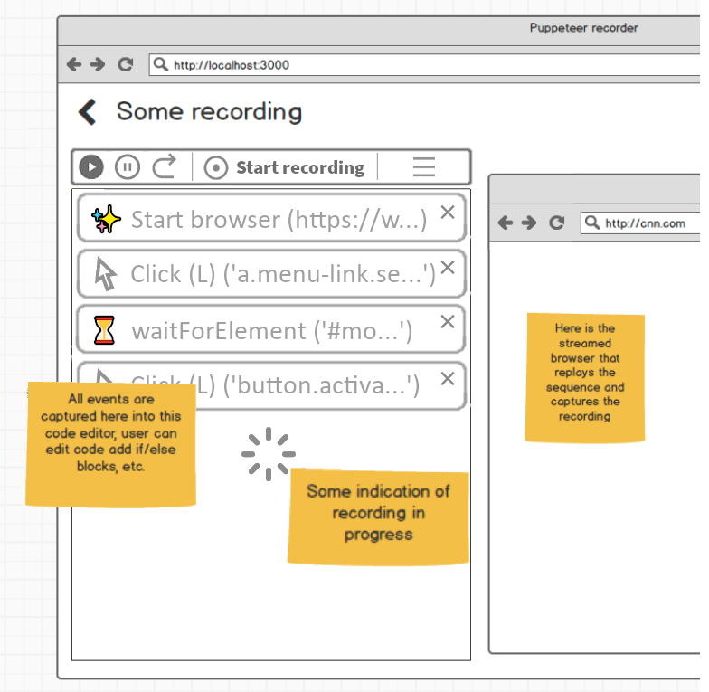

## Design
In this part, I elaborate on the design of the application. 

## Backend
- The backend server part of the application has no <abbr title="Graphical User Interface">GUI</abbr> (runs in <abbr title="Command Line Interface">CLI</abbr> mode only). It should be implemented in [Node.js](https://nodejs.org/), which is particularly useful in this case for its native integration of *Playwright*.
- Server should offer connection over both HTTP (to serve the webpage with UI) and [WebSockets](https://developer.mozilla.org/en-US/docs/Web/API/WebSockets_API) and [WebRTC](https://webrtc.org/) (to communicate with the client and stream the Playwright environment during the recording session).
    - For the realtime video streaming, some HTTP-based protocols (namely [DASH](https://dashif.org/) and [HLS](https://tools.ietf.org/html/rfc8216)) also went into consideration. *WebRTC* is still seen as a more suitable option as both HTTP-based protocols are still (as of April 2021) prone to latency problems.
    - The client - server communication (sending commands during the recording session) could be also implemented using HTTP, for example using REST-like API. In this case, *WebSockets* seem as a better option, mostly for the smaller overhead and possibility of bidirectional communication.
- Server should also provide persistent storage for user-made code snippets (recordings and custom edited code). Here, using simple files and a *Node.js* filesystem API is preferable, since the main purpose of the application is to run these files (Playwright can run code from file) and letting users to download the code files. For this reason, storing code in any kind of database-like structure would add an unnecessary layer of complexity. Uploading code from local storage into Pwww is not allowed as it poses as a security threat (and would require custom code parsing and analysis).

## Frontend
- The front-end application should be written using [React.js](https://reactjs.org/) for the UI logic and [Bootstrap](https://getbootstrap.com/) for UI elements and layout management.
    - Other UI frameworks, such as [Angular](https://angular.io/) or [Vue.js](https://vuejs.org/) also went into consideration here. *React.js* is preferred for its combination of a relatively small memory footprint, fast execution times and detailed documentation.
    - As for the component design libraries, several others were considered (namely [Material UI](https://material-ui.com/) and [Ant Design](https://ant.design/docs/react/introduce)). Bootstrap got selected mainly because of its recognizable and simple design and widespread browser support.
     
### Main Menu
|  | 
|:--:| 
| *Main Menu Mockup (courtesy of Apify)* |

After startup, the user is in the *Main Menu*, where they can see a list of their existing recordings. 
- By clicking any of the recordings, the user is taken to the *Snippet Detail Screen*. By clicking the *New Recording* button, the user is taken to the *Snippet Detail Screen* as well (a blank one).
- By clicking the X button and confirming this decision, user deletes the respective recording from the server.
- By double-clicking the name part of the record, user can rename the recording.

### Snippet Detail Screen
|  | 
|:--:| 
| *Snippet Detail Screen Mockup (courtesy of Apify, modified)* |

The **Snippet Detail Screen** is the main window of the entire application, as the recordings are being made and edited here.
- This screen is vertically divided into two parts: *Code* and *Playwright Environment*. Even though there are no real technical limitations regarding the client screen size / orientation, using Pwww on portrait oriented devices (e.g. smartphones) is not expected due to nature of the application.
- The *Code* part is where the generated code appears, in the uppermost part of the *Code* section, there is also a *Control Bar* with *Play*, *Pause*, *Step*, *Start Recording* and *Settings* buttons. 
    - Clicking the *Settings* button opens a context menu with *Delay* setting. By editing this value, the user sets the delay before running each "code block command". 
    - Double-clicking any of the code blocks opens a modal window with *Playwright* code editor, where the user can customize this specific section of the generated code.
    - At the bottom of the *Code* section, there is a *New Block* button (disabled during active recording session). Clicking this button also opens a modal pop-up window with empty textarea field, where the user can enter their own custom code.
- In the *Playwright Environment* section, there is an HTML5 canvas element, receiving the Playwright video stream. 
    - By interacting with this canvas (clicking, typing with the canvas in focus), the front-end application sends these events to the Playwright session on server (preferably using *WebSockets* to ensure reliable, low overhead communication).
    - During the recording/playback session, server streams a screencast of the Playwright session to the client app (using binary transmission over *WebSockets*, *WebRTC* or *DASH/HLS*. For simplicity and sturdiness, the *DASH* solution is preferable, as it does not involve low-level manipulation with data and is well documented, however for low latency, which is crucial in this application, the *WebRTC* approach is much more suitable. 
- By clicking the "Export" button in the upper right corner of the screen, user can download the current Playwright script to their device, which is trivial as the script is already saved as a file on the server. This script should be executable by user's local instance of Playwright (or anywhere else, think web scraping automation services etc.)