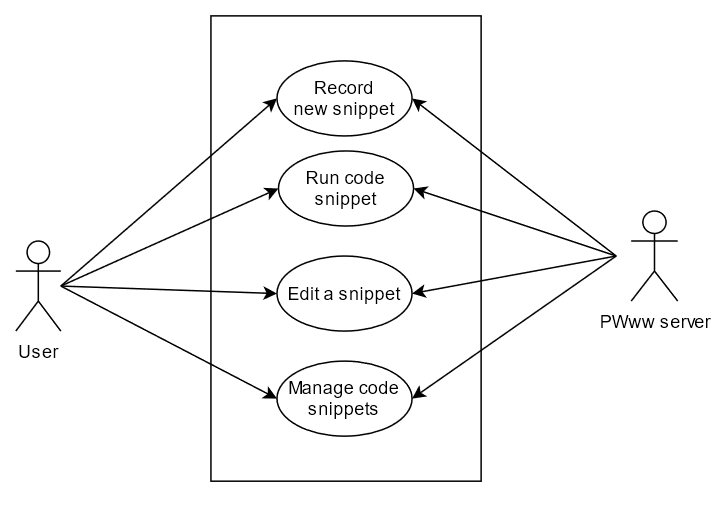

## Use case analysis
In this part of the project analysis, I describe possible use cases and workflows.

### UML Use Case Diagram
In the following diagram, the relations between actors and their use cases are depicted.

### Use case descriptions
In the following section, I introduce all the possible use cases in a more detailed manner and describe the required steps to achieve those. 

#### Creating a new recording
When recording a new code snippet, the user interacts with the streamed *Playwright* environment, which results in generating the code snippet.
- The user enters the recording screen.
- By providing a valid URL, user starts a new Playwright recording session.
- During the recording phase, user interacts with the streamed Playwright environment, sending commands to the Playwright session running on the server, which then generates the Playwright code and streams the current state of the browser back to the user.
- The generated code is being continuously visualised to the user.
- When finished, user stops recording.

#### Playing an recording
After recording a code snippet, the user can replay the recording to review it.
- User selects the desired recording and opens it.
- Using a simple interface, user can play/pause/resume the recording or set delay between individual commands.
- By starting the playback, user spawns a new Playwright environment on the server, in which is then the current code executed.
- User can also review the recording in a step-by-step manner (execution of every new command waits for a signal from the user).

#### Editing a recording
After recording a code snippet, the user can edit its parts to achieve the expected behaviour.
- After recording, user can pick an arbitrary code block and edit it.
- Furthermore, user can also add their own custom code.
- User can rearrange the code blocks and therefore change the order of their execution. 
- User can delete existing code.

#### Managing the recordings
The user can also manage the existing recordings.
- User can select a recording and either delete it, or rename it.